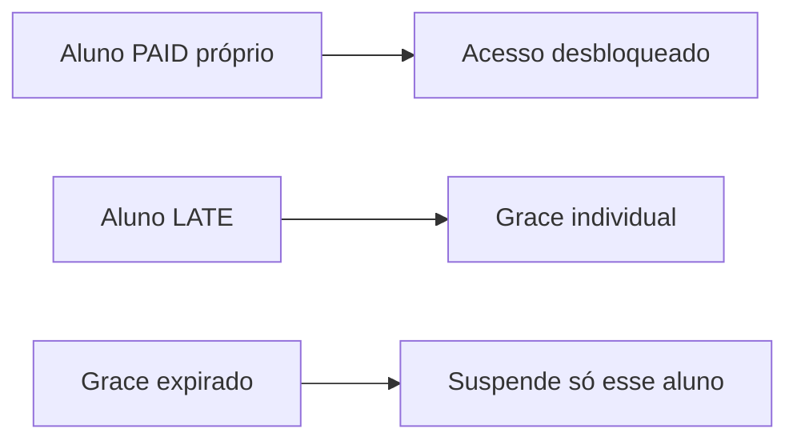

# Plano Família (Kingdom Família)

Gestão **exclusiva na secretaria** (`/admin/familias`). Não aparece em `/escolher-plano`.

## Regras

| Aspeto | Comportamento |
|--------|----------------|
| **Acesso** | Equivalente ao **Kingdom Presencial MMA** (`plan-familia`: todas as modalidades, digital, performance, check-in ilimitado) |
| **Cobrança** | **80 €/mês por pessoa** no grupo (desconto face ao FULL ~100 €); cada aluno tem a sua linha `TUITION` |
| **Membros** | **A partir de 2 pessoas**, sem limite máximo por grupo |
| **Matrícula / seguro** | **Individuais** por aluno (como qualquer inscrição) |
| **Self-service** | Não — **só a secretaria (admin)** cria o grupo e adiciona cada membro em `/admin/familias` |
| **Titular na app** | Vê o grupo no dashboard e paga a sua mensalidade; **não** adiciona pessoas (fora do MVP) |

## Modelo de dados

- Migração base: `supabase/migrations/20260701120000_family_plan.sql`
- Mensalidade por pessoa: `supabase/migrations/20260706120000_family_plan_per_person_tuition.sql`
- Tabelas: `FamilyGroup`, `FamilyGroupMember`
- Plano: `plan-familia` — `Plan.priceMonthly` = **80** (referência por pessoa; constante `KINGDOM_PLAN_FAMILIA_MONTHLY_PER_PERSON` em `lib/kingdom-plans-constants.ts`)
- `Payment.familyGroupId` — mensalidade TUITION associada ao grupo (titular e membros)

## Fluxo admin

1. **Criar grupo** — `/admin/familias/novo` **ou** atribuir `plan-familia` ao aluno em `/admin/alunos`: o grupo é criado automaticamente com ele como titular (`ensureFamilyGroupAsTitular`)
2. **Adicionar membros** — detalhe do grupo; cada membro recebe `plan-familia` e mensalidade **80 €** (**só admin**, não o titular)
3. **Registar pagamento** — em **cada** aluno do grupo: mensalidade 80 €; matrícula/seguro via «Primeiro pagamento» quando aplicável. O titular pode pagar por todos no balcão (vários registos).
4. **Desactivar grupo** — `isActive = false`; não remove histórico

### Experiência do aluno

- **Dashboard:** banner «Plano família» (titular ou membro, contagem `{n}/{max}`, aviso de gestão na secretaria)
- **Titular e membros:** cada um desbloqueia com os **próprios** pagamentos em dia (mensalidade + inscrição inicial)

## Pagamentos e acesso

- **Middleware:** `lib/family-payment-gate.ts` — desbloqueio com **PAID próprio** (sem herança do titular)
- **Cron mensal:** gera `LATE`/`TUITION` de **80 €** para **cada** membro do grupo com plano família
- **Suspensão:** individual por aluno (`lib/payment-grace.ts`); sem cascata titular→membros
- **Backfill:** `backfillFamilyGroupTuitions` ao abrir `/admin/familias` cria mensalidades em falta

## Código principal

- `lib/family-tuition.ts` — valor 80 € e `familyGroupId` em pagamentos
- `lib/family-group.ts` — contexto, listagem, atribuição de plano
- `lib/family-payment-gate.ts` — gate middleware (Edge)
- `app/admin/familias/` — UI admin

## Fora do MVP

- Convites self-service no dashboard
- Stripe para plano familiar
- Desconto progressivo por membro adicional (além dos 80 € fixos)
