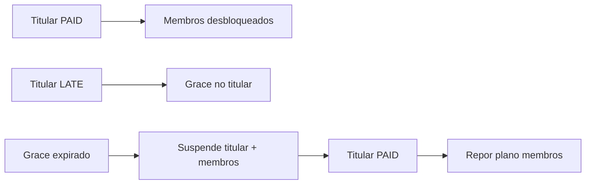

# Plano Família (Kingdom Família)

Gestão **exclusiva na secretaria** (`/admin/familias`). Não aparece em `/escolher-plano`.

## Regras

| Aspeto | Comportamento |
|--------|----------------|
| **Acesso** | Equivalente ao **Kingdom Presencial MMA** (`plan-familia`: todas as modalidades, digital, performance, check-in ilimitado) |
| **Cobrança** | **Uma mensalidade** no **titular** (`FamilyGroup.billingStudentId`) |
| **Membros** | Limite configurável por grupo (`maxMembers`, mínimo 2) |
| **Matrícula / seguro** | **Individuais** por aluno (como qualquer inscrição) |
| **Self-service** | Não — admin cria grupo, adiciona membros, regista pagamentos |

## Modelo de dados

- Migração: `supabase/migrations/20260701120000_family_plan.sql`
- Tabelas: `FamilyGroup`, `FamilyGroupMember`
- Plano: `plan-familia` (preço do pacote em `Plan.priceMonthly`, editável em `/admin/planos`)
- `Payment.familyGroupId` — mensalidade TUITION do titular associada ao grupo

## Fluxo admin

1. **Criar grupo** — `/admin/familias/novo`: titular, escola, `maxMembers`
2. **Adicionar membros** — detalhe do grupo; cada membro recebe `plan-familia` sem linha de mensalidade
3. **Registar pagamento** — no **titular**: mensalidade familiar; nos membros: só matrícula/seguro via «Primeiro pagamento»
4. **Desactivar grupo** — `isActive = false`; não remove histórico

## Cascata de pagamento

- **Middleware:** membros sem `PAID` próprio passam se o titular tem pelo menos um `PAID`
- **Cron mensal:** ignora membros não-titular; gera `LATE` só no titular
- **Suspensão:** `lib/payment-grace.ts` propaga suspensão/restauro aos membros

## Código principal

- `lib/family-group.ts` — contexto, listagem, sync titular↔membros
- `lib/family-payment-gate.ts` — gate middleware (Edge)
- `app/admin/familias/` — UI admin

## Fora do MVP

- Convites self-service no dashboard
- Stripe para pacote familiar
- Desconto progressivo por membro adicional
